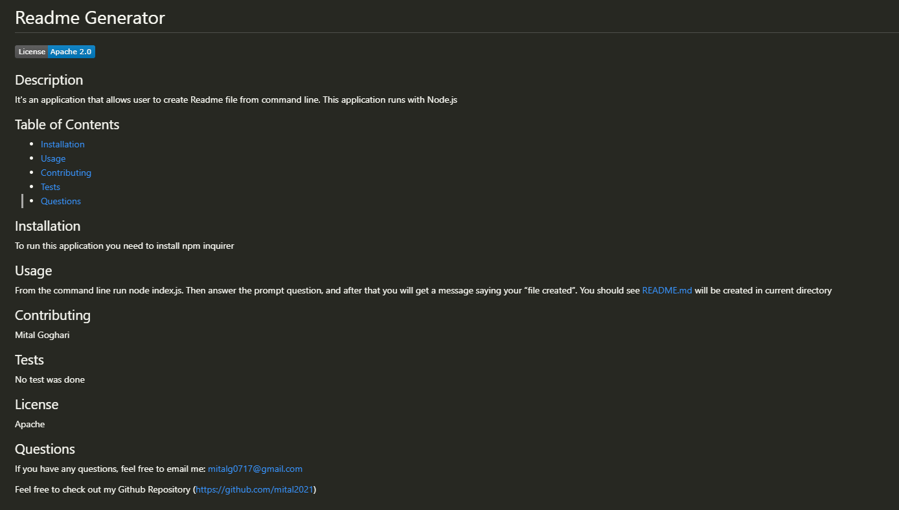

# Readme Generator

## Description

It's an application that allows user to create Readme file from command line. This application runs with Node.js

## Table of Contents

* [Installation](#installation)
* [Usage](#usage)
* [Contributing](#contributing)
* [Tests](#tests)
* [Questions](#questions)

## Installation
To run this application you need to install npm inquirer

## Usage
From the command line run node index.js. Then answer the prompt question, and after that you will get a message saying your “file created”. You should see README.md will be created in current directory.

## Contributing

Mital Goghari

## Tests

No test was done

## License
Apache

## Questions

If you have any questions, feel free to email me:
mitalg0717@gmail.com

Feel free to check out my Github Repository (https://github.com/Mital2021)

